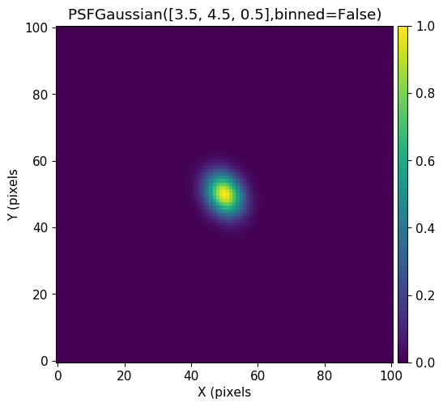
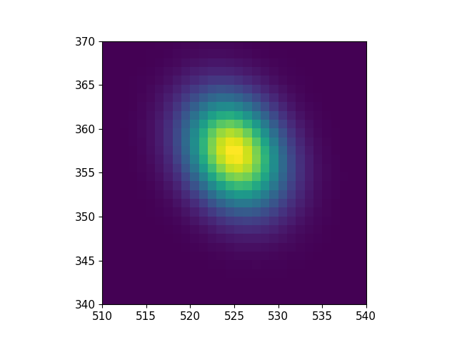

***************
Getting Started
***************

How it works
============

|Prometheus| uses stars to derive an analytical point spread function (PSF) for an image.  It then fits the height and central coordinates of all stars *simultaneously* using the PSF.

The CCDData Object
==================

This is the object type used for images and is based on the astropy CCDData type but has some additional capabilities that are needed for |Prometheus|.

.. code-block:: python

        from prometheus.ccdata import CCDData
	image = CCDData(flux,error,mask=mask)

You can also read an image directly from a file.
	
.. code-block:: python

        from prometheus.ccdata import CCDData
	image = CCDData.read('ccd1100.fits')

You can also write a CCDData object to file.  This saves the flux, error, mask and sky (computed) to file.
	
.. code-block:: python

	image.write('outfile.fits')
        
CCDData objects have a ``sky`` image property.  This can be set manually, but is calculated directly from the image using ``sep`` (Python and C library for Source Extraction and Photometry) package.

It also has a bounding box property (``bbox``) using the photutil ``BoundingBox`` class.  This can be useful when you take a slice of an image because it will remember what the original coordinates were.

	
The PSF Model Object
====================

There are currently three different analytical functions available in |Prometheus|: Gaussian, Moffat and Penny (Gaussian core and Lorentizn-like wings).  Eventually an empirical look-up table option will also be available.  There are separate classes for each type.  You can instantiate an object directly using these classes or use the ``psfmodel()`` utility function.

.. code-block:: python

	# Create PSF model specific class
	from prometheus.models import PSFGaussian,PSFMoffat,PSFPenny
	psf = PSFGaussian([3.5,4.5,0.5])

	# Create PSF model using psfmodel() utility function

The first PSF parameter is the ``height`` of the star.  This means that the PSF is defined with a height of 1 (not a flux of 1).  To get the flux you can use ``psf.flux()`` for height=1 or input a set of parameters ``psf.flux(pars)`` (only the height is used).

The Full Width at Half-Max (FWHM) can be easily obtained for any PSF type using ``psf.fwhm()``.
	
You can easily read and write a PSF to file.
	
.. code-block:: python

	# Write a PSF to a file
	psf.write('mypsf.psf')	

	# Now read it in
	from prometheus import models
	newpsf = models.read('mypsf.psf')

You can fit a single star directly using the PSF.

.. code-block:: python

	# Fit a star in an image
	initpars = [1000.0,5.6,15.6]  # height, xcen, ycen
	outpars,model = psf.fit(image,initpars)

You can also subtract many stars from an image using the ``sub()`` method.

.. code-block:: python

	# Subtract all stars in a catalog from an image
	subim = psf.sub(image,starcat)
	
To get a quick thumbnail of the PSF shape with ``psf()``.

.. code-block:: python
		
	psf = PSFGaussian([3.5,4.5,0.5])
	plt.imshow( psf() )
	

To use the PSF model you simply need to give it the parameters of the star (height, xcenter, ycenter) and
the pixels you want the PSF to cover.  You can either give the model

1. the X and Y pixel values (as 2D or 1D arrays),
2. a BoundingBox object, or
3. a range of X/Y pixel values [[x0,x1],[y0,y1]] (NOTE, x1 and y1 are *not* included).

.. code-block:: python

	# Generate a PSF for a star
	psf = PSFGaussian([3.5,4.5,0.5])
	model = psf(pars=[1000.0,524.5,356.8],bbox=[[510,540],[340,370]])
	plt.imshow(model,origin='lower',extent=[510,539,340,369])
	

How to Fit Stars
================

|Prometheus| has three ways that you can fit stars.

1. Fit a single star with :meth:`psf.fit()<prometheus.models.PSFBase.fit>`
2. Fit a group of overlapping stars with :func:`groupfit.fit()<prometheus.groupfit.fit>`.
3. fit all stars in an image with :func:`allfit.fit() <prometheus.allfit.fit>`.

They each need a PSF model, an image to fit, and an estimate for the stellar parameters (at least their x/y coordinates).

Let's fit a single star:

.. code-block:: python

	psf = PSFGaussian([3.5,4.5,0.5])
	initpars = [1000.0,54.0,148.0]
	out,model = psf.fit(image,initpars)

Fit a group of stars:

.. code-block:: python

	psf = PSFGaussian([3.5,4.5,0.5])
	# initcat must be a catalog with at least "x" and "y" columns
	out,model = groupfit.fit(psf,image,initcat)

Fit all stars in an image:

.. code-block:: python

	psf = PSFGaussian([3.5,4.5,0.5])
	# initcat must be a catalog with at least "x" and "y" columns	
	out,model = allfit.fit(psf,image,initcat)

	
The Important Modules
=====================

|Prometheus| has a number of useful modules.

* :mod:`~prometheus.ccddata` contains the `~prometheus.ccddata.CCDData` object used for images.
* :mod:`~prometheus.models` contains the various PSF models.
* :mod:`~prometheus.detection` can be used to detect sources using ``sep`` or ``photutils``.
* :mod:`~prometheus.aperture` measures aperture photometry.
* :mod:`~prometheus.getpsf` is used to fit the PSF for an image. 
* :mod:`~prometheus.groupfit` can be used to fit a group of overlapping data.
* :mod:`~prometheus.allfit` fits all stars in an image.
* :mod:`~prometheus.prometheus` runs through all steps for processing an image.
* :mod:`~prometheus.synth` can be used to generate synthetic/fake images.

